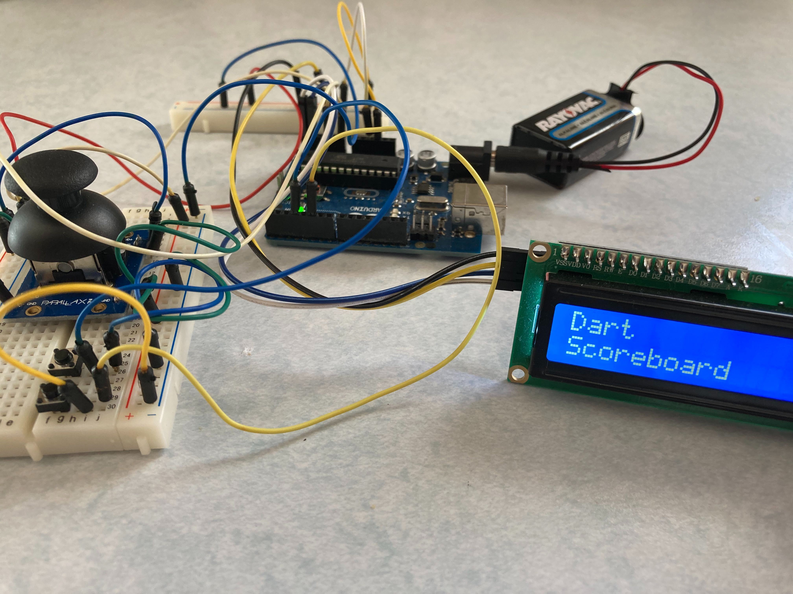
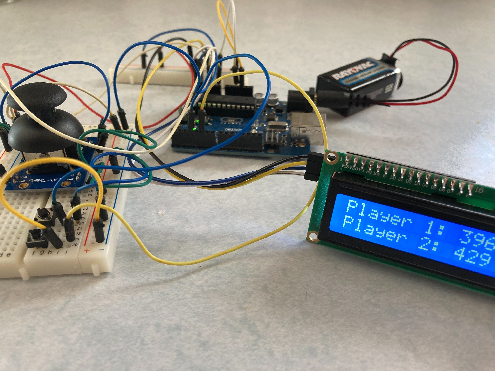

# ArduinoDartScoreboard

This was a hobby project I designed from scratch. It's a little controller and display for calculating darts scores for two players. The pinout can be seen in `Pinout.png`

The Arduino pins can be remapped in `Darts/Config.cpp`

## Directions
* Press any button to begin
* Rotate joystick to simulate dartboard values, or 
* Leave in the center for 0 points, outer bullseye, or inner bullseye

* Press Button1 if you received no multiplier or missed the dartboard
* Press Button2 to select a X2 multiplier or outer bullseye (25 points)
* Press Button3 to select a X3 multiplier or inner bullseye (50 points)

* The game will continue to calculate your score until somebody has won

## Components Needed
1. Arduino Uno
2. Parallax 2-Axis Joystick (Or two potentiomenters)
3. Breadboard
4. I2C LCD
5. Jumper wires (Male-Male and Male-Female)
6. Three two-pin buttons

